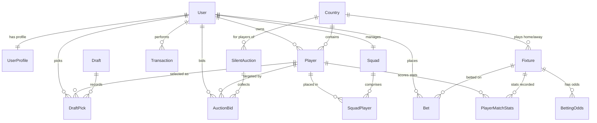

# Database Schema - Champions Web App

This document provides a visual representation of all database tables and models implemented in the **Champions** project.

## Entity-Relationship (ER) Diagram

---

## Tables & Models Breakdown

### 1. Accounts App (`accounts`)
#### `UserProfile`
Stores user finances and game progress.
- `user`: OneToOne (Django User)
- `balance`: Decimal (Default: $10,000,000)
- `total_points`: Decimal (Default: 0)
- `is_admin`: Boolean
- `created_at`: DateTime

---

### 2. Core App (`core`)
#### `Country`
Represents a competing country in the World Cup.
- `name`: CharField
- `code`: CharField (Unique ISO code)
- `flag_url`: URLField
- `api_team_id`: Integer (Unique API ID)
- `is_eliminated`: Boolean
- `group`: CharField

#### `Player`
Represents a professional soccer player.
- `name`: CharField
- `photo_url`: URLField
- `api_player_id`: Integer (Unique API ID)
- `country`: ForeignKey (`Country`)
- `position`: ChoiceField (GK, DEF, MID, FWD)
- `market_value`: Decimal
- `total_fantasy_points`: Decimal
- `owner`: ForeignKey (Django User, Nullable)
- `is_available`: Boolean
- `jersey_number`: Integer

#### `Fixture`
Represents a World Cup match.
- `api_fixture_id`: Integer (Unique API ID)
- `home_team`: ForeignKey (`Country`)
- `away_team`: ForeignKey (`Country`)
- `kick_off`: DateTime
- `status`: ChoiceField (scheduled, live, finished, postponed, cancelled)
- `home_score`: Integer
- `away_score`: Integer
- `round`: CharField
- `venue`: CharField
- `stats_processed`: Boolean

#### `PlayerMatchStats`
Performance stats for a player in a specific match.
- `player`: ForeignKey (`Player`)
- `fixture`: ForeignKey (`Fixture`)
- `minutes_played`: Integer
- `position_played`: CharField
- `rating`: Decimal
- `was_substitute`: Boolean
- `goals`/`assists`/`goals_conceded`: Integer
- `saves`: Integer
- `passes_total`/`passes_key`/`pass_accuracy`: Integer/Char
- `tackles`/`interceptions`/`blocks`: Integer
- `duels_total`/`duels_won`: Integer
- `dribbles_attempted`/`dribbles_success`: Integer
- `shots_total`/`shots_on_target`: Integer
- `fouls_drawn`/`fouls_committed`: Integer
- `yellow_cards`/`red_cards`: Integer
- `penalties_scored`/`penalties_missed`/`penalties_saved`/`penalties_won`: Integer
- `fantasy_points`: Decimal

---

### 3. Squad App (`squad`)
#### `Squad`
A user's fantasy team.
- `user`: OneToOne (Django User)
- `formation`: CharField (Default: '4-3-3')
- `created_at`/`updated_at`: DateTime

#### `SquadPlayer`
Individual player assignments in a squad.
- `squad`: ForeignKey (`Squad`)
- `player`: ForeignKey (`Player`)
- `is_starter`: Boolean
- `position_slot`: CharField (e.g. 'DEF1', 'SUB2')

---

### 4. Draft App (`draft`)
#### `Draft`
A draft session.
- `status`: ChoiceField (waiting, active, completed)
- `pick_order`: JSONField (User ID array)
- `current_pick_index`: Integer
- `time_per_pick_seconds`: Integer
- `current_pick_deadline`: DateTime
- `started_at`/`completed_at`/`created_at`: DateTime

#### `DraftPick`
A choice made during draft.
- `draft`: ForeignKey (`Draft`)
- `user`: ForeignKey (Django User)
- `player`: ForeignKey (`Player`)
- `pick_number`: Integer
- `picked_at`: DateTime

---

### 5. Betting App (`betting`)
#### `BettingOdds`
- `fixture`: ForeignKey (`Fixture`)
- `bet_type`: CharField (match_winner, exact_score)
- `odds_data`: JSONField
- `fetched_at`: DateTime

#### `Bet`
- `user`: ForeignKey (Django User)
- `fixture`: ForeignKey (`Fixture`)
- `bet_type`: CharField
- `prediction`: CharField
- `odds`: Decimal
- `stake`: Decimal
- `status`: ChoiceField (pending, won, lost, cancelled)
- `payout`: Decimal
- `placed_at`/`resolved_at`: DateTime

---

### 6. Transfers App (`transfers`)
#### `Transaction`
Ledger of all balances/transactions.
- `user`: ForeignKey (Django User)
- `type`: ChoiceField (starting_budget, bet_stake, transfer_buy, etc.)
- `amount`: Decimal
- `description`: TextField
- `created_at`: DateTime

#### `SilentAuction`
Auction triggered for players of eliminated countries.
- `country`: ForeignKey (`Country`)
- `status`: ChoiceField (open, resolved, cancelled)
- `opens_at`/`closes_at`/`created_at`: DateTime

#### `AuctionBid`
Bids submitted by users during silent auctions.
- `auction`: ForeignKey (`SilentAuction`)
- `user`: ForeignKey (Django User)
- `target_player`: ForeignKey (`Player`)
- `bid_amount`: Decimal
- `placed_at`: DateTime
